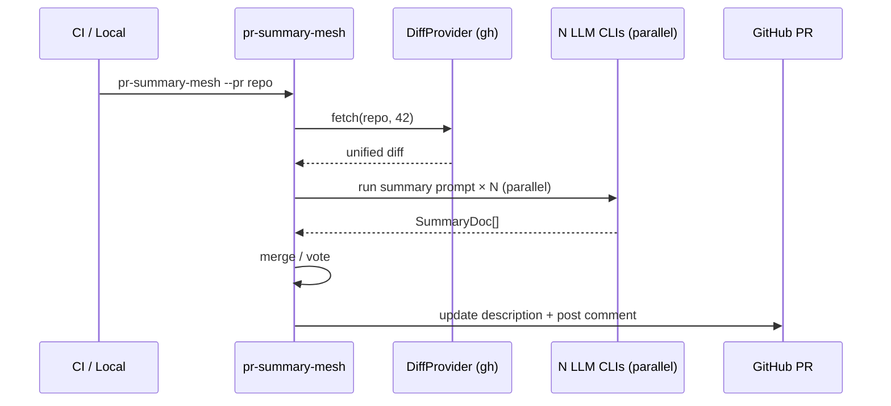

# pr-summary-mesh

> **Modular multi-LLM pull-request summarizer.** Register *any* command-line LLM via YAML or one-line flags — the orchestrator is vendor-neutral. Aggregates findings, updates the PR description with a structured summary, posts per-file walkthroughs as a bot comment. CI-ready GitHub Action.
>
> _Examples in this README mention specific vendors (Claude / Gemini / Copilot / Ollama) because they're the most common command-line LLMs at time of writing — they are illustrations, not requirements._

[](https://github.com/M00C1FER/pr-summary-mesh/actions)


## What it does

On every PR (or on demand):
1. **Fetches the diff** via the `gh` CLI (or any `DiffProvider` you register).
2. **Dispatches the same summary prompt** across N registered LLM CLIs in parallel (`ThreadPoolExecutor`).
3. **Aggregates** with one of two strategies:
   - `merge` — structural section-by-section merge with per-CLI attribution
   - `vote` — pick the response with the most thorough sections
4. **Renders a PR description fragment** wrapped in a `<!-- pr-summary-mesh -->` marker so re-runs find/replace the block cleanly.
5. **Posts** the result as a PR description update + a bot comment with file walkthroughs.

## Why modular

Existing PR summarizers (GitHub Copilot built-in, CodeRabbit AI) lock you to one vendor. **pr-summary-mesh** registers any number of LLMs through a vendor-neutral CLI registry. Same YAML format as `triple-review` — one config powers both your review gate and your summary layer.

## Quick start

### Local CLI

```bash
pip install git+https://github.com/M00C1FER/pr-summary-mesh.git   # PyPI release pending

# Summarize a real PR via gh
pr-summary-mesh --pr owner/repo#42 --mode merge

# Summarize a local diff file (offline / testing)
pr-summary-mesh --diff-file changes.patch --render json

# Inspect what summarizers will dispatch
pr-summary-mesh --list-clis --diff-file /dev/null
```

### GitHub Action

```yaml
on: pull_request
jobs:
  summarize:
    runs-on: ubuntu-latest
    permissions: { pull-requests: write, contents: read }
    steps:
      - uses: actions/checkout@v4
      - uses: M00C1FER/pr-summary-mesh@v0.1.0
        with:
          config: .github/triple-review.yaml   # SAME yaml as triple-review
          mode: merge
          update-description: true
```

## Modular CLI registration

Three ways to register summarizers, mutually compatible:

### 1. YAML (recommended for repos)

`pr-summary.yaml` (or reuse a `triple-review.yaml`):
```yaml
summarizers:           # alias: clis
  - { name: claude,  cmd: [claude, -p, --output-format=text] }
  - { name: gemini,  cmd: [gemini, -p] }
  - { name: copilot, cmd: [copilot, -p] }
  - { name: ollama,  cmd: [ollama, run, qwen2.5-coder], timeout_s: 600 }
  - { name: my-rev,  cmd: [./scripts/my-llm-summary.sh] }
```

### 2. Inline flags

```bash
pr-summary-mesh --cli "claude=claude,-p" \
                --cli "ollama=ollama,run,qwen2.5-coder" \
                --pr owner/repo#42
```

### 3. Programmatic

```python
from pr_summary_mesh import SummaryConfig, run_summary, merge_structural

cfgs = [
    SummaryConfig(cli="claude", cmd=["claude", "-p"]),
    SummaryConfig(cli="any-vendor", cmd=["./adapter.sh"]),
]
docs = run_summary(open("changes.patch").read(), configs=cfgs)
merged = merge_structural(docs)
print(merged.tldr)
```

## Aggregation modes

### `merge` (default)

Each section is concatenated with `[cli]` attribution. Reviewers can trace any line back to the model that wrote it.

```
**TL;DR**

[claude] Refactors auth flow to use JWT issuer instead of session cookies.

[gemini] Replaces session-cookie auth with stateless JWT; updates middleware accordingly.

**Risk**

[claude] Any client holding live session cookies will be logged out at deploy time.
[gemini] Possible CSRF risk if SameSite cookie config isn't tightened in tandem.
```

### `vote`

Picks the single SummaryDoc with the most filled-in sections (length-based proxy for thoroughness). Useful when the audience wants one voice instead of merged perspectives.

## How the dispatch flows



## Pairs naturally with `triple-review`

These two are designed to share the same `triple-review.yaml`. Register your CLIs once, get both:

| Tool | Layer | Output |
|---|---|---|
| `triple-review` | issue gate | per-line `[unanimous/critical] file.py:8 — hardcoded API key` |
| **`pr-summary-mesh`** | **narrative layer** | **PR description with TL;DR / Files / Risk / Test plan** |

Together they form a complete PR-comment surface — issues *and* context — both vendor-agnostic.

## Testing

```bash
pip install -e .[dev]
pytest
```

17 tests cover prompt parsing, merge/vote aggregation, PR-body rendering, YAML config loading (both `summarizers:` and `clis:` keys), inline flag parsing, parallel dispatch with stub runners, and the diff provider interface.

## Roadmap

- v0.2: actual GitHub PR-update integration in the Action wrapper (requires `gh pr edit` calls)
- v0.3: per-file walkthrough comments (one comment per file with substantial diff)
- v0.4: LLM-as-judge `vote` mode with cross-rating (CLIs grade each other's summaries)

## License

MIT.
